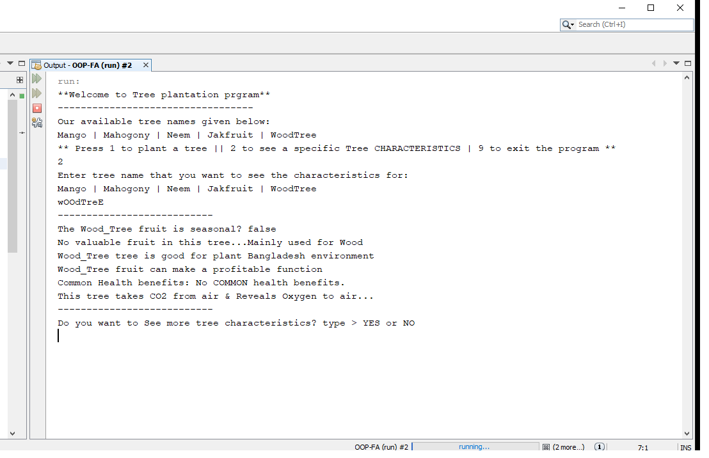
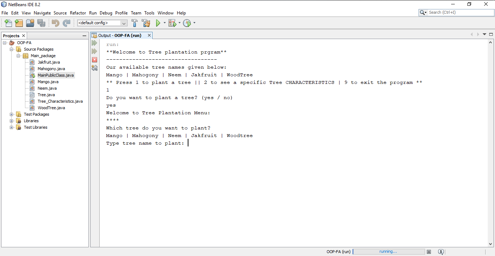

## Problem Analysis:

There are around 60000 species of trees in the world. In the coming Rainy season students of the CIS department are going to plant some trees. Most of the trees have some common things. More precisely, there is a basic structure for a tree but different types of trees have different features within that structure. The student will apply the key concepts of object-oriented programming like encapsulation, inheritance, polymorphism, and exception handling while coding this problem.

## Problem Statement:

- There will be a basic structure of a tree where you will use the concept of abstract class or interface.
- At least 3 different types of trees should be created. If you create more, it will be appreciated.
- Each tree has some features (scientificName, leafColor, growthRate, isMangrove(boolean) etc.) and some functionalities(photosynthesis, generateOxygen, absorbCarbonDyoxide etc.). Features should be expressed through variables and functionalities should be expressed through methods. Variables and methods can be(public/private/protected/private/default) and can be final/static also.
- Every method should be overridden differently in different types of trees.
- Apply the exception handling mechanism according to the need as there may arise some difficulties while coding some sensitive parts.
- Use array of objects so that several types of created trees can be displayed easily.
- Use the idea of static variables while printing the number of total trees created of each type.

#### Sample Outputs:

* More output in the 'screen-shot' directory
